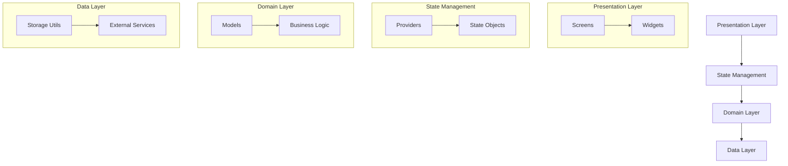

# システムパターン

## アーキテクチャ概要



## 技術スタック
1. フレームワーク
   - Flutter (Android専用)
   - Dart言語

2. 開発環境
   - Android Studio
   - Android SDK
   - Java（バージョン17で試行するも警告は残存）
   - Android NDK（バージョン27.0.12077973）

2. 状態管理
   - Provider パターン
   - ChangeNotifier による状態更新
   - Widget ツリーを通じた状態伝播

3. データモデル
   - Freezed による immutable オブジェクト
   - JSON シリアライゼーション
   - コード生成による型安全性

## デザインパターン
1. Provider Pattern
   - 状態管理の中心的パターン
   - 依存性注入の実現
   - Widget ツリーを通じたデータフロー

2. Repository Pattern
   - データアクセスの抽象化
   - ストレージ実装の分離
   - テスト容易性の確保

3. Factory Pattern
   - モデルオブジェクトの生成
   - JSON変換の実装
   - テストデータの生成

## コード構成規則
1. ディレクトリ構造
   ```
   lib/
   ├── models/      # データモデル
   ├── providers/   # 状態管理
   ├── screens/     # 画面UI
   ├── widgets/     # 再利用可能なUI部品
   ├── utils/       # ユーティリティ
   └── l10n/        # 多言語化
   ```

2. 命名規則
   - クラス: PascalCase
   - メソッド: camelCase
   - 定数: UPPER_CASE
   - private変数: _prefixUnderscore

3. ファイル構成
   - 1ファイル1クラス原則
   - 関連する拡張は同一ディレクトリ
   - テストファイルは別ディレクトリ

## テスト戦略
1. 単体テスト
   - Providerのロジック
   - モデルのシリアライズ
   - ユーティリティ関数

2. ウィジェットテスト
   - UI表示の検証
   - インタラクションの確認
   - 状態変更の反映
